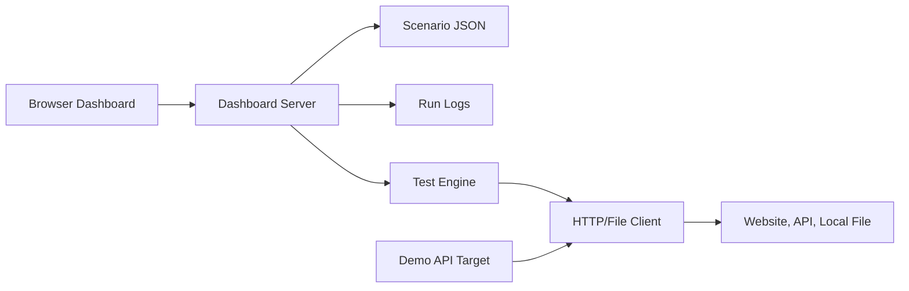

# Architecture

Sheheri Test Engine is intentionally local-first and dependency-light.

## Components

- `public/`: landing page and dashboard UI.
- `src/dashboard/server.js`: static server, API routes, run control, report export, target probing.
- `src/engine/`: concurrent user simulation loop.
- `src/api/client.js`: zero-dependency HTTP, HTTPS, and local file reader.
- `src/demo/`: self-contained demo API and demo-test launcher.
- `scenarios/`: built-in and custom scenario JSON files.
- `logs/`: generated JSON run reports.

## Design Goals

- No external runtime dependencies.
- Useful immediately after clone.
- Works with public URLs, localhost apps, APIs, and local HTML files.
- Produces durable JSON/CSV reports for portfolio demos and debugging.
